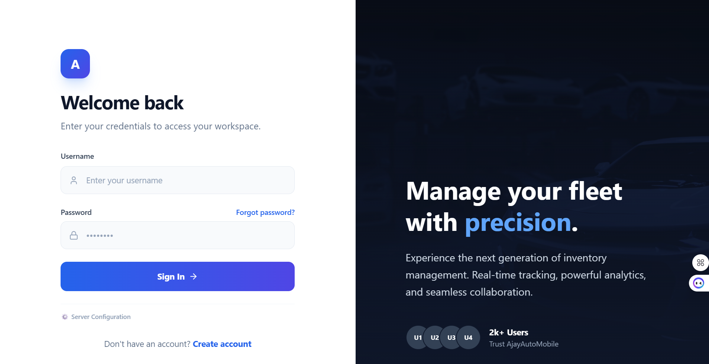
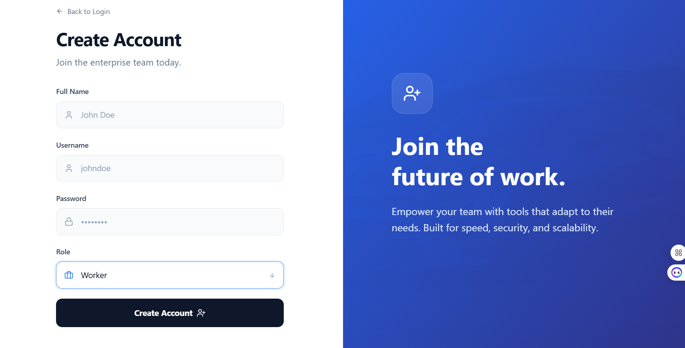
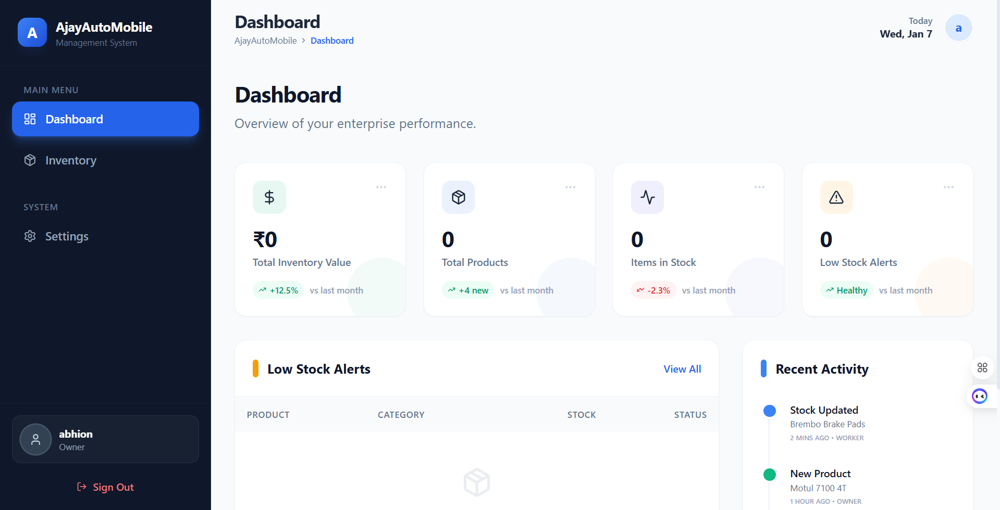
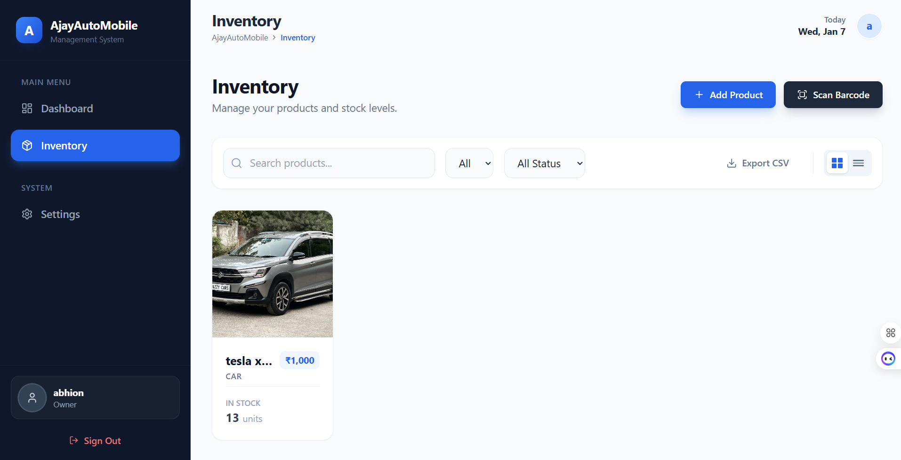
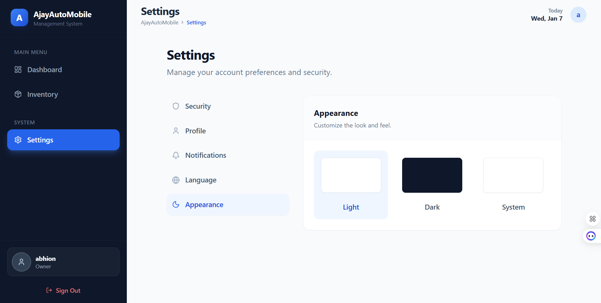
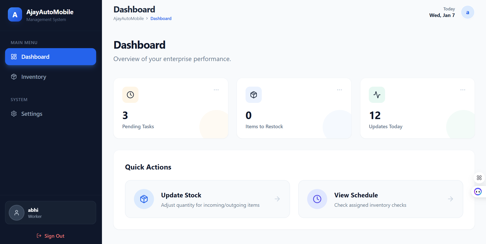
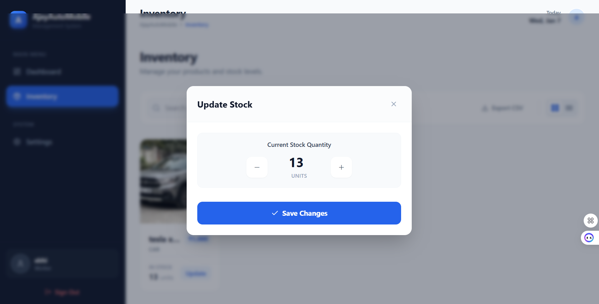

# 🚗 Automobile E‑Commerce Dashboard

[🔗 Live Website](https://ecommerce-automobile-dashboard.vercel.app) • [📁 GitHub Repository](https://github.com/abhi041540/Ecommerce-automobile-Dashboard)

**Automobile E‑Commerce Dashboard** is a modern, enterprise-grade web application designed for automobile businesses. It streamlines **inventory management, staff operations, financial tracking, and secure communication**. With features like **low stock alerts, worker-driven stock updates, staff salary management, and JWT authentication**, it ensures efficiency, transparency, and security.

---

## ✨ Key Features

- 📦 **Inventory Management**
  - Real-time automobile stock tracking
  - Low stock alerts & notifications
  - Worker-driven stock price updates after sales

- 👨‍💼 **Staff Management**
  - Staff activity tracking
  - Leave & salary management
  - Role-based access control

- 💰 **Financial Insights**
  - Daily profit & loss calculation
  - Revenue & expense dashboards
  - Exportable reports

- 🔐 **Secure Communication**
  - JWT Auto Authentication
  - Encrypted TCP/IP WebSocket connections
  - Real-time updates across modules

- 🎨 **User Experience**
  - Responsive UI with Tailwind CSS & Bootstrap
  - Optimized performance with React + Vite
  - Intuitive dashboards & modern design system

---

## 🖼️ Visual Preview

### 🔑 Login Page
  
Secure entry point for staff and owners with JWT authentication.

---

### 📝 Sign Up Page
  
New staff or owners can register securely with role-based access.

---

### 📊 Owner Dashboard
  
Centralized view for owners to monitor sales, staff activity, and inventory health.

---

### 📦 Owner Inventory
  
Detailed inventory management with stock levels, low-stock alerts, and worker updates.

---

### ⚙️ Owner Settings
  
Configuration panel for managing staff roles, salaries, and system preferences.

---

### 👨‍🔧 Worker Dashboard
  
Workers can view their sales, update stock prices, and track performance.

---

### 📦 Worker Inventory Management
  
Workers update stock count after sales, enabling accurate tracking of sales and stock levels.

---

## 🛠️ Tech Stack

| Layer       | Technology            |
|-------------|------------------------|
| Frontend    | React.js, Vite, Tailwind CSS, Bootstrap |
| Backend     | Node.js, Express       |
| Authentication | JWT, auth0           |
| Communication | WebSockets (TCP/IP)  |
| Hosting     | Vercel, Docker, GCP   |
| Database    | PostgreSQL / MongoDB |

---

## 🚀 Getting Started

To run the project locally:

```bash
# Clone the repository
git clone https://github.com/abhi041540/Ecommerce-automobile-Dashboard
cd ecommerce-automobile-dashboard

# Install dependencies
npm install

# Start the development server
npm run dev
